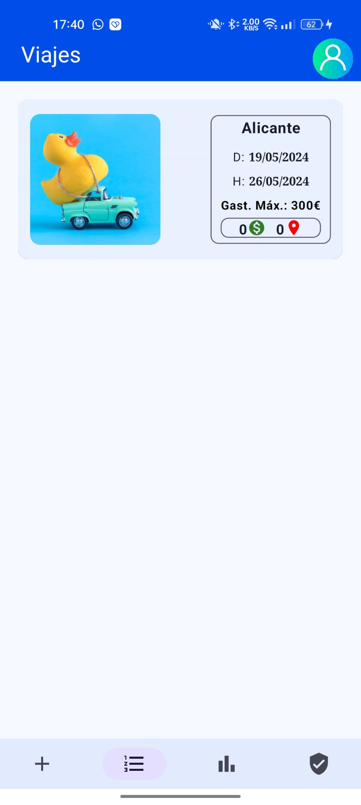

# <center> **Documentación Proyecto Fin De Curso**  </center>

<!--  -->
  <div class="img">
    
  </div>


## <div class="img"> ***TravelMate, Planificador de Viajes*** </div>

### <div class="img"> **Josep Lloret Díaz - 2º DAM B** </div>

### <div class="img"> **IES Doctor Balmis** </div>


**ÍNDICE.**

- **Documentación TravelMate**
  - **[1. Abstract.](#1-abstract)**
  - **[2. Introducción.](#2-introducción)**
    - **[2.1 Objetivo del Proyecto.](#21-objetivo-del-proyecto)**
    - **[2.2 Justificación.](#22-justificación)**
    - **[2.3 Innovación.](#23-innovación)**

  - **[4. Requisitos Funcionales de la Aplicación.](#4-requisitos-funcionales-de-la-aplicación)**
  - **[5. Diseño y Análisis.](#5-diseño-y-análisis)**
    - **[5.1 Diagrama de arquitectura de la aplicación.](#51-diagrama-de-arquitectura-de-la-aplicación)**
    - **[5.2 Diagrama casos de uso.](#52-diagrama-de-casos-de-uso)**
    - **[5.3 Diagrama de clases.](#53diagrama-de-clases)**
    - **[5.4 Esquema Entidad - Relación.](#54-esquema-e-r)**
    - **[5.5 Diagrama de Red.](#54-esquema-e-r)**
  - **[6. Codificación.](#6-codificación)**
    - **[6.1 Lenguajes de programación usados.](#61-lenguajes-de-programación-usados)**
    - **[6.2 Código con los aspectos relevantes de las implementación.](#62-herramientas-utilizadas-entornos-de-desarrollo-y-plataformas-empleadas-en-la-implementación-del-sistema)**
  - **[7. Manual de Usuario.](#7-manual-de-usuario)**
    - **[7.1 Login.](#71-login)**
    - **[7.2 Registro.](#72-registro)**
    - **[7.3 Cambio de Contraseña.](#73-cambio-de-contraseña)**
    - **[7.4 Inicio.](#74-inicio)**
      - **[7.4.1 Crear Viaje.](#741-crear-viaje)**
      - **[7.4.2 Lista de Viajes.](#742-lista-de-viajes)**
      - **[7.4.3 Gasto Máximo Por Viaje.](#743-gasto-máximo-por-viaje)**
      - **[7.4.4 Apartado Usuario.](#744-apartado-usuario)**

  - **[8. Requisitos e Instalación.](#8-requisitos-e-instalación)**


# **1. Abstract.**
  TravelMate is a mobile application dedicated to travel management and planning in order to improve the user travel experience, transforming a chaotic management into an organized one in the palm of any user's hand, bringing them the chance to have sites, itineraries and expenses in a single app.

  The objective of our app is to avoid having a chaotic planning of a trip, thus improving the experience of our end user, being able to be used by anyone with an Android smartphone.

  To get this we have decided to use the convenient languages in order to create a simple, organized and efficient code. The languages we have decided to use for this are Kotlin for the Android part, using Jetpack Compose, which is a very powerful development toolkit, able to simplify the code obtaining a simple, clean and intuitive user interface. In addition, with Kotlin it is possible to perform the business logic in a simple and easy way, ensuring connectivity with the server.

  For the server side (backend) we have opted for a server with a virtual machine with Linux, where it's been installed MySQL for the database and Tomcat for the deployment of the API REST, so you can make a request to the api, which connects to the local database efficiently.

  In the future we would love to be able to scale the application and this would entail an improvement of the server. It remains to be seen how this app would be in the market and depending on their downloads we could make these improvements or not. In addition to this, we would also like to focus on other Operating Systems such as IOS using Swift, as it offers a large market being a good opportunity.


>

# **2. Introducción.**

## **2.1 Objetivo del proyecto.**

  **TravelMate** es una aplicación móvil dedicada a la **gestión y planificación de viajes** de forma que cualquier usuario mejore su experiencia a la hora de hacer un viaje, así convirtiéndolo de una gestión caótica a una **gestión organizada** en la palma de la mano de cualquier usuario, **siendo capaz de usarlo cualquier persona** que tenga un dispositivo 

  Con **TravelMate** podrás tener una **gran mejora** a la hora de **planificar**, teniendo a mano un **mapa**, una **lista de sitios** que visitar en el viaje, **gastos** a realizar y **lista de cosas** que llevar a cada uno de estos.


  La app permite a **cualquier usuario crear y organizar itinerarios** de viaje, **agregar distintas actividades, calcular un presupuesto estimado** de cada uno de estos. El usuario podrá tener toda la **información necesaria para planificar** y disfrutar de sus viajes de manera más **organizada y eficiente.** Ya no será necesario llevar consigo guías de viaje impresas o realizar cálculos complicados para controlar los gastos. **Todo estará al alcance de su mano en su dispositivo móvil.**


  La aplicación **se desarrollará** utilizando tecnologías **móviles** modernas, como el lenguaje de programación **Java para la API-REST** y **Kotlin con JetPack Compose para la App** . Se seguirán las mejores prácticas de diseño de interfaces de usuario para crear **una experiencia de usuario intuitiva y atractiva.** Además, **se implementarán medidas de seguridad para proteger la información personal del usuario.**


  **TravelMate** tiene como objetivo convertirse en la **herramienta indispensable** para todos los amantes de los viajes, **facilitando la planificación, organización y disfrute de cada aventura.** Con esta aplicación, los usuarios podrán explorar el mundo de manera más inteligente y memorable.


  - La **intención** de esta app es:
   	- Mejorar la experiencia de un viaje.
   	- Tener todos los sitios pensados en la palma de la mano.
   	- Tener una aproximación del gasto del mismo.
   	- Listar viajes realizados.


## **2.2 Justificación.**

Se ha elegido el desarrollo de este proyecto porque han habido ocasiones en las que he querido ir de viaje y una vez estando en él no he podido llegar a gestionar el tiempo de cada sitio en el que quería ir, tampoco se ha tenido claro el dinero que se ha podido llegar a gastar en él, teniendo que emplear más tiempo del necesario en “echar cuentas” para saber el gasto que se ha tenido, haciendo una experiencia “caótica”. Con esta app la intención es ordenar y tener a mano toda esta información tanto para garantizar la visita a los sitios pensados anteriormente, así ir con más “tranquilidad” a un viaje.

  

## **2.3 Innovación.**

Hay varias apps orientadas a la gestión de viajes, como es el caso de **“JetCost”**, pero **“TravelMate”** a diferencia de esta está pensada para viajes en carretera y además incluye la funcionalidad para ver los gastos que hemos hecho en cada viaje, para así tener un control de lo que gastamos en cada uno de ellos, también podremos ver los lugares que hemos añadido en una pantalla con marcadores de cada uno de ellos sobre un mapa.

Otra opción sería la aplicación **“TravelSpend”**, que ofrece servicios similares a los de **“TravelMate”**.


# **4. Requisitos Funcionales de la Aplicación.**


  Todo el mundo quiere ir de viaje, para ello normalmente la gente intenta **planificar donde irá, cuanto se gastará, qué cosas se pueden hacer cerca del punto de viaje, donde se hospedará,** para ello hemos querido **simplificar** la forma en la que este "trámite" se realiza, así pudiendo hacer una experiencia versátil para cada usuario.

  En la app hay varias funcionalidades para que cumplen los requisitos para remediar los objetivos anteriormente descritos. Para ello se ha implementado:


  - **Creación de Usuarios**, el cual cada uno tiene sus propios viajes. Para ello se puede crear un usuario siguiendo la ruta pertinente de la ventana inicial.

  - Nada más entrar la primera pestaña que es la que se abre por defecto te pide **crear un viaje nuevo, estos se añadirán a cada usuario que tiene sesión iniciada.**
  
  - **Podremos listar los viajes** en la siguiente pestaña aquí es donde está la parte importante, donde se encuentra la resolución de estos objetivos, en el podremos listar los viajes ya realizados y donde **podremos ver los detalles de cada uno de estos**, así teniendo una **visión simple de los viajes que vamos a realizar.** **En el se detallarán los sitios y gastos implicados en cada viaje.**
    - Dentro de cada viaje listado podremos modificar el viaje, añadiendo gastos y lugares que vamos a visitar. Al entrar en la sección lugares, se podrá añadir y quitar, además de tener un acceso a un mapa Google Maps de forma que podremos ver todos los lugares de la ciudad que hemos añadido en el viaje, así teniendo una vista general de donde se encuentra más o menos cada uno de estos.
  
  - La 3ª pestaña será para controlar los gastos de cada viaje, dónde tendremos una visión de el total gastado en cada viaje. Se muestra en uná gráfica de barras la cual es muy intuitiva y fácil de leer.


  - La siguiente y ultima pestaña es para la **configuración de usuario**, en el podemos ver los datos del usuario (Nombre, correo, etc...), **donde también podremos cerrar la sesión.**


# **5. Diseño y Análisis.**


  Para explicar el diseño de la aplicación se han preparado varios **esquemas y diagramas** para que se pueda entender el funcionamiento de la app y así sea fácil analizar tanto la arquitectura de la misma, como la conectividad entre las dos aplicaciones **(App Android y API REST JAVA)**, por ello se han creado los siguientes diagramas:


##  **5.1 Diagrama de arquitectura de la aplicación**


  - En este diagrama podemos ver la **interoperabilidad** entre las distintas opciones de la **app en Android y la API REST de JAVA** en la maquina virtual en la nube en Linux, **haciendo posible la conexión de estas y llevando a cabo operaciones CRUD en las BBDD** que también se encuentra en la misma máquina que la API.


## **5.2 Diagrama de casos de uso:**


  <div class="img">
    
  </div>


  - En el podemos ver los **distintos casos de uso que tiene la app**, dejando claras las distintas posibilidades que trae la aplicación, pudiendo ver **el comportamiento del sistema mediante la interacción del usuario**. 
  


## **5.3 Diagrama de clases:**


  - En él podremos ver las 4 clases necesarias para la ordenar y gestionar la información.


  
    - **UsuarioApi : data class**: Contiene un identificador único para cada usuario, un email de las cuales se usará para enviar un correo de bienvenida además de para enviar un código de recuperación de contraseña, además este también se usa al iniciar sesión para obtener los viajes del usuario, comparando correo e id, contraseña para poder autenticarse y una imagen de perfil.

    - **ViajeApi : data class**: Contiene un usuarioApi, por que cada viaje pertenece a un usuario, un id, que es un identificador único de cada viaje, kilómetros realizados, aunque este carece de sentido y probablemente se termine cambiando por máximo gasto por viaje, un nombre, que será necesario escribir el nombre real de una ciudad para poder tener una mejor experiencia en la app, fecha inicio y fecha fin, además de una imagen de cada viaje.

    - **GastoApi : data class**: Contiene una descripción del propio gasto como puede ser taxi, cena, etc... un identificador único para diferenciar cada gasto, un viajeId, porque cada gasto pertenece a un viaje y el propio gasto que será un número decimal.

    - **LugarApi : data class**: Con latitud y longitud, para poder situar cada lugar en un mapa de GoogleMaps, estas dos propiedades se obtienen gracias al nombre del lugar, ya que con la API de Google Places podemos obtener una latitud y una longitud con solo su nombre, un nombre para identificarlo además de para obtener las coordenadas, como se ha descrito anteriormente y un viajeId, porque cada lugar pertenecerá a un viaje.


  - Podremos obtener estas 4 clases en la app gracias a **UsuarioRepository, ViajeRepository, GastoRepostitory y LugarRepository**, y partir de ellas podemos hacer **la lógica de negocio**, obteniendo como resultado **el siguiente diagrama**:


  - Obtenemos los data class Gasto, Lugar, Viaje y Usuario gracias a la conversión y la inyección de Hilt estas cuatro con la cual haremos toda la lógica en cada ViewModel, usando listas de estos para poder gestionar la información que pertenece a cada usuario.


  - **LoginViewModel (Para gestionar Login)**:
  
    
  
      - **onMostrarSnackBar:** es una función que decide cuando mostrar el SnackBar con su información pertinente.

      - **usuarioUiState:** estado de usuario para gestionar el login, el cual se le pasará su información al inicio.

      - **validacionLoginUiState:** estado que valida la información del usuario para que esta sea correcta, la contraseña debe tener 8 caracteres, el nombre mas de 4 caracteres y el email tenga su formato correcto.

      - **usuarioIdState:** estado usado para mantener el id del usuario.

      - **mostrarSnackBar:** estado usado para saber si mostrar el SnackBar o no.


    - **ResetPassWordViewModel (Para gestionar recuperación de contraseña)**:
    
  
      - **validacionLoginUiState:** estado que valida la información del usuario para que esta sea correcta, la contraseña debe tener 8 caracteres, el nombre mas de 4 caracteres y el email tenga su formato correcto.

      - **usuario:** estado de usuario para gestionar la información introducida.

      - **email:** instancia de la clase mail el cual se usa para enviar el código de recuperación y así poder cambiar la contraseña.

      - **codigo:** estado donde se almacena el código enviado por la clase mail.

      - **codigoIntroducido:** código introducido por el usuario para ser comparado por el generado y comprobar sea el correcto.

      - **esCodigoEnviado:** estado para saber si el código ha sido enviado.

      - **mensajeSnack:** estado usado para almacenar el mensaje que se mostrará en la SnackBar.

      - **emailIntroducido:** estado usado para almacenar el email introducido por el usuario.

      - **contraseñaIntroducida:** estado usado para almacenar la contraseña introducida por el usuario.

      - **mostrarSnackBar:** estado usado para saber si mostrar el SnackBar o no.


    - **InicioViewModel (Para gestionar la pantalla de inicio)**:
    

      - Este ViewModel es el **encargado de gestionar las pantallas principales de inicio**, en él se gestionan la información de 4 screen, dependiendo en qué posición del NavBar se encuentra, **gestiona las Screen de CrearViaje, ListarViajes** en este podremos acceder a la modificación de cada viaje, añadiendo lugares y gastos a cada uno según la selección hecha de viaje, además también **gastos por viaje**, el cual muestra una gráfica intuitiva de gastos hechos por cada viaje siendo fácil ver en cual se ha gastado más y menos, **también se encarga de la configuración**, en esta pantalla podremos salir de la app, ver la información del usuario en un diálogo, eliminar el usuario y además modificarlo navegando a otra pantalla donde podremos modificar.  

      - **verDialogoEliminacionUsuario:** Estado Booleano para saber cuando mostrar el diálogo de confirmación de eliminación de usuario.

      - **idSeleccionado:** Con este estado sabemos en qué indice del NavBar nos encontramos, de esta forma podemos determinar que Screen mostrar por cada indice del propio NavBar.

      - **listaGastosState:** Lista donde se obtienen los gastos de cada viaje.

      - **fechaFinState:** Estado donde se almacena la fecha fin.

      - **fechaInicioState:** Estado donde se almacena la fecha Inicio.

      - **verDialogoViajeEliminado:** Estado Booleano para saber cuando mostrar el diálogo de que se ha eliminado un viaje correctamente.

      - **esItemSeleccionado**: Con este podremos saber si se ha seleccionado un viaje en la lista de viajes así cambiando la NavBar por una BottomBar donde podremos abrir maps con el viaje seleccionado o bien editarlo.

      - **listaViajesState:** Lista donde se gestionan los viajes de cada usuario.

      - **verDialogoViajeCreado:** Estado usado que almacena si se debe mostrar el diálogo de que se ha creado un viaje correctamente.

      - **verDialogoSalirApp:** Con el se determina cuando se debe mostrar el diálogo de confirmación para salir de la app.

      - **verDialogoDialogoFechaInicio:** Estado usado para determinar si se debe mostrar el DatePicker de la fecha inicio.

      - **verDialogoDialogoFechaFin:** Estado usado para determinar si se debe mostrar el DatePicker de la fecha fin.

      - **correoUsuario:** Estado usado para almacenar el email del usuario y poder obtener su información con una petición HTTP.

      - **viajeState:** Estado usado para almacenar el estado del viaje que se va a modificar.

      - **viajeStateMaps:** Estado usado para almacenar el estado del viaje que se le proporcionará a maps para saber donde posicionar su cámara.

      - **cantidadGastos:** En él se almacenará los gastos que tiene cada viaje.

      - **cantidadLugares:** En él se almacenará los lugares que tiene cada viaje.

      - **usuarioUiState:** Almacena el usuario para cada viaje creado, este se usará para hacer la inserción del viaje en la base de datos con una petición http.

      - **indiceState:** Índice para saber la posición del elemento viaje de la lista viajes.

      - **verDialogoUsuario:** Estado usado que almacena si se debe mostrar el diálogo con la información del usuario que ha iniciado sesión.

      - **listaLugaresState:** Lista donde se obtienen los lugares de cada viaje.


    - **LugarViewModel (Para gestionar los lugares de cada viaje)**: 
    
  
      - **lugarState:** Estado que almacena la información del lugar que se va a gestionar.

      - **verDialogoCreacion:** Determina si se debe mostrar el dialogo cuando se crea un lugar exitosamente.

      - **viajeUiState:** Almacena el viaje al cual se le va a añadir el lugar.

      - **placesClient:** Este es encargado de hacer la conexión y las peticiones a la API Places de Google.

      - **listaLugares:** Lugares de cada viaje.

      - **verDialogoEliminacion:** Determina si se debe mostrar el dialogo cuando se elimina un lugar exitosamente.


    - **GastosViewModel (Para gestionar los lugares de cada viaje)**: 
    
  
      - **lugarState:** Estado que almacena la información del lugar que se va a gestionar.

      - **muestraDialogoCreacion:** Determina si se debe mostrar el dialogo cuando se crea un gasto exitosamente.

      - **viajeState:** Almacena el viaje al cual se le va a añadir el lugar.

      - **placesClient:** Este es encargado de hacer la conexión y las peticiones a la API Places de Google.

      - **listaGastos:** Gastos de cada viaje.

      - **muestraDialogoEliminacion:** Determina si se debe mostrar el dialogo cuando se elimina un gasto exitosamente.


    - **UpdateUserViewModel (Para gestionar la modificación de los datos del usuario)**: 
    
  
      - **usuarioUiState:** Estado que almacena la información del usuario que se va a gestionar.

      - **mostrarDialogoModificado:** Determina si se debe mostrar el dialogo cuando se actualiza un usuario exitosamente.

      - **nuevaContraseña:** Almacena la contraseña introducida por el usuario si se ha modificado.

      - **validacionUpdate:** Valida los datos introducidos por el usuario tenga formato correcto.

      - **usuarioIdState:** Estado del identificador único del usuario.

      - **imagen:** Almacena en Base64 la información de la imagen de perfil de un usuario.


    - **MuestraLugaresViewModel (Para gestionar los lugares del viaje)**: 
    
  
      - **listaMarcadores:** Lista con la información de los marcadores para luego poder ser mostrados en el mapa de Google Maps.

      - **viajeState:** Viaje al cual se le insertarán los lugares.

      - **cameraPositionState:** Estado donde se guarda la posición de la cámara donde debe estar la pantalla de Google Maps.

      - **cityCoordinates:** Coordenadas de la ciudad, este se determina con el nombre del viaje, por ello se pide un nombre real para tener una experiencia completa de la aplicación.


  >:bulb: **UpdateViajeViewModel** contiene los mismos estados y mismas variables que para la creación solo que en este caso modifica, no inserta. 


- En el diagrama podemos ver como cada **ViewModel obtiene usuarios, viajes, lugares y gastos según la necesidad**, donde a partir de ellos **se realiza una lógica de negocio y con cada una de las propiedades descritas en cada tabla podemos hacer interactiva nuestra aplicación**, como resultado de esta lógica de negocio podemos tener **una experiencia intuitiva, ya que según que propiedades modifiquemos nuestra UI cambiara**, esto se debe **gracias al patrón MVVM con JetPack Compose**.


## **5.4 Esquema E-R:**


<div class="img">

</div>


  - Este esquema representa las **relaciones entre las 4 tablas** donde guardamos toda la información relevante de la app, **pudiendo gestionar toda la información** de forma sencilla gracias a las tablas relacionales en **MySQL**. **Un Viaje tiene un Usuario y un Usuario puede tener varios viajes, Un Gasto y un Lugar puede tener un Viaje y un Viaje puede tener varios Lugares o Gastos.** 


##  **5.5 Diagrama de Red:**


<div class="img">
  
</div>


- En él podemos ver la **representación de las conexiones para poder realizar las peticiones http** para gestionar y así poder **realizar las distintas operaciones CRUD** de la base de datos, en el cual vemos como cada usuario a través de internet puede hacer estas peticiones de forma independiente unos de otros, así **cada uno puede acceder a sus viajes, gastos y lugares correspondientes**. Todos tienen acceso a la vez, mientras que cada uno recibe su propia información.


 


# **6. Codificación.**


## **6.1 Lenguajes de programación usados.**


  - Para la codificación se han planteando varios aspectos, a la hora de saber qué tecnologías y qué lenguajes usar para el desarrollo de este proyecto se han tenido en cuenta varios factores, por una parte la facilidad de manejar código, para que sea un código legible, limpio, potente y capaz de obtener un buen resultado a la hora de programar la interfaz, también se ha querido tener en cuenta el acceso a datos, de forma que se pueda implementar un código capaz de obtener de manera rápida y segura la información requerida en cada momento, para ello se han elegido los siguientes lenguajes de programación: 


    - El primero es **JAVA**, para la **API REST que está desplegada en Tomcat**, ya que es **multiplataforma, siendo una API REST es fiable y segura, además nos posibilita la programación orientada a objetos** así haciendo un código solido y eficaz para el desarrollo de nuestro sistema. Es de **código abierto** esto nos ofrece varias ventajas, entre ellas, su comunidad es grande, si tenemos algún problema podemos encontrar una solución de manera rápida, ya que hay muchos foros relacionados con él, además también tiene **flexibilidad para la adaptación, configuración y personalización.** Tiene librerías para la conexión con MySQL, teniendo una respuesta rápida y concisa.


    - El segundo **no es un lenguaje de programación como tal**, es un **sistema de gestión de bases de datos relacionales**, este es **MySQL**, con el tenemos implementados nuestras 4 tablas, de las cuales todas tienen relación entre ellas, **MySQL** nos permite **realizar consultas con precisión, de forma segura y rápida.**


    - Para la parte del **frontend y el desarrollo móvil Android** hemos usado **Kotlin**, este es un lenguaje muy potente, **en el fondo es JAVA**, esto quiere decir que nos permite tener las mismas ventajas, **teniendo una gran potencia de desarrollo para la parte lógica, creando clases y data class para la gestión de la información.** Además hemos usado **el kit de desarrollo de Jetpack Compose**, este es un **kit de herramientas moderno que nos permite crear interfaces de usuario con menos código de forma más rápida y entendible para el programador.** Al ser declarativo describimos qué queremos y él es el encargado de hacer los componentes y composables según hayamos descrito, esto convierte el código en una jerarquía consiguiendo manejar las estructuras por bloques como si fuera un "Lego". Es reactivo, esto quiere decir que cualquier cambio se propaga por su estructura de forma automática.


    - Por último **tampoco es un lenguaje de programación como tal, es un lenguaje de marcado**, pero **para generar esta documentación se ha usado MarkDown**, ya que con él se consigue un texto limpio, además de una buena integración del código para ser explicado, lo que lo hace fácil de leer.


## **6.2 Herramientas utilizadas, entornos de desarrollo, y plataformas empleadas en la implementación del sistema.**


  - Se han usado distintas herramientas para el desarrollo de este sistema, para la parte del **servidor** son las siguientes:


    - **NetBeans**: Para el desarrollo de la API REST se uso NetBeans, ya que nos ofrece muchas herramientas para la creación, desarrollo y mantenimiento del código, es fácil de usar e intuitivo, haciendo cómoda la programación de estos, este tiene implementado Tomcat, así pudiendo desplegar el proyecto REST en local para poder hacer cualquier prueba.

    - **Tomcat**: Para el despliegue de la API REST se ha usado Tomcat, es ligero, gratis y permite la implementación de peticiones de forma rápida y eficaz.

    - **Workbench**: Para gestionar la base de datos MySQL antes de estar implementada en la aplicación además de generar el esquema E-R.  

    - **Postman**: Nos permite realizar peticiones HTTP de manera rápida, pudiendo guardar sus resultados para el análisis de la respuesta a la petición HTTP.  

    - **Swagger**: Es una forma eficaz de auto-documentar el la página donde tenemos el API REST, haciendo que las peticiones desde el navegador sean sencillas, también se puede hacer una petición POST o UPDATE, facilitando las pruebas de esta.

    - **Azure**: Gracias a Microsoft hemos podido tener a mano una herramienta muy potente donde podemos crear maquinas virtuales, en nuestro caso de Linux, ya que siendo ligero quitamos gran parte de carga a nuestro servidor.

    - **Putty**: Nos ha permitido crear una conexión con la máquina virtual de forma remota ya que carece de interfaz de usuario y tenemos que realizar las instalaciones por comandos.

    - **Tomcat**: Esta herramienta la hemos comentado antes, ya que venía integrada en Netbeans, obviamente al estar desarrollada en esto hemos tenido que instalarlo en la máquina virtual para realizar un despliegue rápido de nuestras aplicaciones.     


  - Para la parte del desarrollo de la app:

      - **Android Studio**: Este es un IDE muy potente, con él podemos implementar de forma rápida y fácil nuestro código en Android, ya que tiene herramientas para ver los cambios al momento de nuestra interfaz de usuario, además también tienen screen mirroring, dejándonos ver nuestro móvil sin necesidad de usar su máquina virtual, esta es otra ventaja ya que si no contáramos con móviles Android, tendríamos otra forma de probar la app, con su máquina virtual que es literalmente un móvil en nuestro PC.   


  - Herramientas usadas para otras cuestiones:

    - **Intellij IDEA**: Nos planteamos usar este IDE, pero consideramos más fácil usar Android Sudio, aún así hemos usado para generar el diagrama de clases existente en este documento en el apartado de **DISEÑO Y ANALISIS**.  

    - **Visual Studio Code**: Para el desarrollo de este documento haciendo fácil la forma en la que lo generamos, nos ha hecho falta instalar algún que otro plugin, estos nos han ayudado bastante.  


## **6.3 Código con los aspectos relevantes de la implementación.**
  


  - Hay varias partes importantes del código, pero hemos querido recalcar en este documento las partes más innovadoras, estas son los distintos fragmentos de código:


### **Envío de email.**


  - El envío del email para el cambio de contraseña con un código y así verificar que quien cambia la contraseña tiene acceso al email. 


  ```Kotlin

    private fun generateCode(): String {
        val allowedChars = ('A'..'Z') + ('a'..'z') + ('0'..'9')
        return (1..6)
            .map { allowedChars.random() }
            .joinToString("")
    }

    // Funcíon que envía código de recuperación vía Email
    // Le llega el usuario al cual va a enviar el email.
    fun sendEmailPassReset(usuario: Usuario): String { 
    // Crea un Multipart, para añadir las partes que necesitemos del mail.
        val multipart: Multipart =
            MimeMultipart() 
    // Parte que añade el HTML a envíar.
        val htmlPart = MimeBodyPart() 
    // Llama a la función que genera un código aleatorio.
        val code = generateCode() 
    // Inicia una corutina para el envío del email.
        CoroutineScope(Dispatchers.IO).launch {
            htmlPart.setText(
                "A continuación le dejamos su código para cambiar la contraseña: <strong style=\"font-family: 'Courier New', monospace;\">${code}</strong>",
                "utf-8",
                "html"
            ) 

    // Añade la parte html al email
            multipart.addBodyPart(htmlPart)
            // Añade todo el contenido al cuerpo del email.
            mailMessage.setContent(multipart) 
            // Indica el asunto del mail.
            setSubject("TravelMate - Código restauración contraseña") 
            setRecipient(usuario.email)
            Transport.send(mailMessage) // Envía el email.
        }
        return code 
    }

  ```


  - Con una **instancia de la Clase Email** (donde se encuentran las funciones descritas anteriormente), desde **ResetPasswordViewModel** tenemos el siguiente código, este es la **acción de un evento del Sealed Interface ResetPassWordEvent:**
  


  ```Kotlin

    is ResetPasswordEvent.onClickEnviaCodigo -> {
        viewModelScope.launch {
            try {
        usuario = usuario.copy(
        id = usuarioRepository.getByMail(emailIntroducido)!!.id,
        email = usuarioRepository.getByMail(emailIntroducido)!!.email,
        contrasena = usuarioRepository.getByMail(emailIntroducido)!!.contrasena,
        nombre = usuarioRepository.getByMail(emailIntroducido)!!.nombre
    )   
                if (usuario.email != "") {  // Si el mail está vacío envía correo.
                    codigo = email.sendEmailPassReset(usuario)
                    esCodigoEnviado = true 
                } else { 
                    mensajeSnack = "El email introducido no existe."
                    mostrarSnack = true
                }
    // Si hay algún error procedemos a mostrar la Snack con un mensaje
            } catch (e: ApiServicesException) { 
                mensajeSnack = "Error al enviar el email con el código."
                mostrarSnack = true
            }
        }
    }


  ```
  

  - Con una **instancia de la Clase Email** (donde se encuentran las funciones descritas anteriormente), desde **NewUserViewModel** tenemos el siguiente código, este es la **acción de un evento del Sealed Interface NewUserEvent:**


  ```Kotlin
     is NewUserPasswordEvent.onClickCrearUsuario -> {
         viewModelScope.launch {
             mostrarSnackState = false
    // Verifica que están los datos con el formato correcto
             validacionNewUserUiState = validadorNewUser.valida(newUserUiState)
             if (validacionNewUserUiState.hayError) {
                 //Si hay error se muestra la Snack con el mensaje del error del formato
                 mensajeSnackBarState = validacionNewUserUiState.mensajeError!!
                 mostrarSnackState = true
             } else {
    // intenta crear un nuevo usuario
                 creaCuenta()
    //Si la funcion anterior anterior consigue
    // crear el usuario, estaCreadaCuenta = true
                 if (estaCreadaCuenta) {
                     mensajeSnackBarState = "Cuenta creada correctamente"
                     mostrarSnackState = true

                     viewModelScope.launch {
                         delay(4000)
                         mostrarSnackState = false
    // Envía correo bienvenida
                         email.sendEmailWelcome(newUserUiState.newUserPasswordUiState.toUsuario())
    //Configura la navegación
                         var navOptions = NavOptions.Builder().apply {
                             setPopUpTo(
                                 HomeRoute, true, false
                             )
                         }
    // Invoca el screen enviando el mail, para luego tenerlo al volver al Login
                         event.onNavigateToLogin?.invoke(
                             newUserUiState.newUserPasswordUiState.email,
                             navOptions.build()
                         )
                     }
                 } else {
                     mensajeSnackBarState = "Ese usuario con ese mail ya existe"
                     mostrarSnackState = true
                 }
             }
         }
     }
  ```

### **Gráfica Gastos Máximos.**

  - Para mostrar los **`gastosPorViaje`** de forma visual se ha decidido recurrir a un repositorio de Jitpack.io para tener una gráfica predefinida de forma rápida, se puede leer la documentación de **`BarChart()`** en la web https://github.com/fracassi-marco/JetChart.
  
      - Se ha tenido que realizar una serie de instalaciones de dependencias, para ello se ha insertado el siguiente código en **`settings.gradle`** y **`build.gradle (Module: app)`** y luego sincronizar o **`ctrl + shift + O`**.
  

```Kotlin

dependencyResolutionManagement {
    repositoriesMode.set(RepositoriesMode.FAIL_ON_PROJECT_REPOS)
    repositories {
        google()
        mavenCentral()
        maven { url "https://jitpack.io" }
    }
}

```

    
```Kotlin
dependencies {
    implementation 'com.github.fracassi-marco:JetChart:1.3.7'
}

```
  - Con estas dependencias hemos conseguido tener la siguiente función Composable.
   
```Kotlin
  
@Composable
fun BarChartComposable(
    gastos: List<GastoUiState>, // Nos llega una lista de gastos
    listaViajes: List<ViajeUiState> // Nos llega una lista
) {
// Obtenemos los gastos por viaje
    val gastosPorViaje = gastos.groupBy { it.viajeId.id }
// De cada gasto por viaje obtenemos sus porcentajes
    val porcentajes = gastosPorViaje.map { (nombreViaje, gastosDelViaje) ->
        val gastoDelViaje = gastosDelViaje.sumOf { it.gasto.toDouble() }
        nombreViaje to gastoDelViaje
    }.toMap()
// Creamos una variable de tipo Bar que son los elementos necesarios paraimplementar la barra
    val bars = remember {
        porcentajes.map { (id, gastoDelViaje) ->
            val maxCharacters = 10 // Define el límite de caracteres que deseas mostrar
//Del primer resultado del id que coincida cogemos su nombre según su tamaño
            val truncatedText =
                if (listaViajes.filter { id == it.id }.first().nombre.length > maxCharacters) {
                    "${
          listaViajes.filter { id == it.id }.first().nombre.substring(
                            0,
                            maxCharacters
                        )
                    }..."
                } else {
                    listaViajes.filter { id == it.id }.first().nombre
                }
// Creamos los Elementos Bar
            Bar(
                label = truncatedText,
                value = gastoDelViaje.toFloat()
            )
        }
    }
// Ancho Barra
    val width = 100 * bars.size
// Si gastos hay gastos por viaje
    if (gastosPorViaje.isNotEmpty()) {
//Creamos una columna
        Column(
            horizontalAlignment = Alignment.Start,
            verticalArrangement = Arrangement.Bottom,
            modifier = Modifier
                .padding(all = 5.dp)
                .height(600.dp)
        ) {
            //Dejamos un poco de espacio
            Spacer(modifier = Modifier.size(40.dp))
            BarChart(
// Creamos la gráfica con las barra obtenidas
                bars = Bars(
                    bars = bars,
                    startAtZero = true
                ),
                //Scroll horizontal
                modifier = Modifier
                    .horizontalScroll(rememberScrollState())
                    .width(width.dp)
                    .height(500.dp),
                // 3s de animación al aparecer
                animation = fadeInAnimation(3000),
                //Color x
                xAxisDrawer = BarXAxisDrawer(
                    axisLineColor = MaterialTheme.colorScheme.primary
                ),
                // Color y
                yAxisDrawer = BarYAxisWithValueDrawer(
                    axisLineColor = MaterialTheme.colorScheme.primary,
                    labelTextColor = MaterialTheme.colorScheme.background
                ),
                labelDrawer = SimpleBarLabelDrawer(
                    labelTextColor = MaterialTheme.colorScheme.primary
                ),
                // Damos formato al texto de las barras
                valueDrawer = SimpleBarValueDrawer(
                    drawLocation = SimpleBarValueDrawer.ValueDrawLocation.Inside,
                    valueTextColor = Color.Black,
                    formatter = {
                        "${it}€"
                    }
                ),
                // Margen entre barras
                barHorizontalMargin = 5.dp
            )
        }
    } else
// Si no hay gastoPorViaje Informamos al usuario de que no hay gastos
        Column(
            verticalArrangement = Arrangement.Center,
            horizontalAlignment = Alignment.CenterHorizontally,
            modifier = Modifier.fillMaxSize()
        ) {
            Text(
                "Aún no tienes gastos",
                textAlign = TextAlign.Center,
                color = MaterialTheme.colorScheme.primary,
                fontWeight = FontWeight.Bold,
                fontSize = 25.sp,
                maxLines = 1
            )
        }
}
```


  - Como resultado se obtiene la siguiente pantalla con la gráfica:
  
  

<div class="img">
  
</div>

  
    
      

### **Implementación Google Maps y Places.**

  - Se ha tenido que realizar una serie de instalaciones de dependencias para instalar la **`API Places`**  de Google, al igual que otras para la función Composable que contiene la funcion **`GoogleMaps()`**
  

```Kotlin

    dependencies {
        ...
        //GoogleMaps
        implementation ("com.google.maps.android:maps-compose:2.11.4")
        implementation ("com.google.android.gms:play-services-maps:18.2.0")
        implementation ("com.google.android.gms:play-services-location:21.2.0")
        //Google Places
        implementation ("com.google.android.libraries.places:places:3.4.0")
    }

```

  - Con estas dependencias instaladas realizamos la siguiente función Composable:
  
```Kotlin

  @Composable
  fun ContentMapa(
  //Valores del Scaffold
      paddingValues: PaddingValues,
  //Lista de Marcadores
      listaMarcadores: List<SitioState>,
  // Posición cámara Maps
      cameraPositionState: CameraPositionState,
  ) {
      Box(
          modifier = Modifier
              .fillMaxSize()
              .padding(paddingValues)
      ) {
  // Llamamos a la función
          GoogleMap(
              modifier = Modifier
                  //Ocupa el máximo posible
                  .fillMaxSize()
                  .clickable {},
              cameraPositionState = cameraPositionState,
              onMapClick = {}
          ) {
  //Recorremos la lista de marcadores
  // Si son 0.0 se excluyen
              listaMarcadores.filter { it.latitud != 0.0 && it.longitud != 0.0 }
                  .forEach {
                      Marker(
                          state = MarkerState(LatLng(it.latitud, it.longitud)),
                          title = it.nombre
                      )
                  }
          }
      }
}
```


  - Para tener la lógica de esta función aquí tenemos parte de  **`MuestraLugaresViewModel.kt: y SitioState`**.

  
  ```Kotlin

data class SitioState(
    val nombre: String = "",
    val latitud: Double = 0.0,
    val longitud: Double = 0.0,
)
@HiltViewModel
class MuestraLugaresViewModel @Inject constructor(
) : ViewModel() {
// contiene latitud y longitu de la ciudad
// se inicializará más tarde
  lateinit var cityCoordinates: LatLng
//Estado del viaje que contiene estos lugares
  var viajeState by mutableStateOf(ViajeUiState())
// Inicializa la posicion de la camara a 0
  var cameraPositionState = CameraPositionState(
      CameraPosition(
          LatLng(0.toDouble(), 0.toDouble()), 12f, 10f, 10f
      )
  )
// lista de SitioState
  var listaMarcadores by mutableStateOf(mutableListOf<SitioState>())
//Función para obtener las coordenadas de una ciudad
// Si no consigue encontrar el lugar en la API
// Inicializa las coords a 0.0
  fun getCityCoordinates(context: Context, cityName: String) {
      val geocoder = Geocoder(context, Locale.getDefault())
      val addresses: List<Address> = geocoder.getFromLocationName(cityName, 1)!!.toList()
      if (addresses.isNotEmpty()) {
          val address = addresses[0]
          cityCoordinates = LatLng(address.latitude, address.longitude)
      } else cityCoordinates = LatLng(0.toDouble(), 0.toDouble())
  }
//Funcion llamada al navegar a la Screen
//Le llega el contexto de la activity, un viaje y una lista de los lugares
  fun inicializaLugares(contexto: Context, viaje: ViajeUiState, lugares: List<LugarUiState>) {
      viewModelScope.launch {
//Copiamos el viaje de este view model por el recibido
          viajeState = viaje
//Obtiene coords con el nombre
          getCityCoordinates(contexto, viaje.nombre)
//Actualiza la posición de la cámara a la ciudad del viaje
          cameraPositionState = CameraPositionState(
              CameraPosition(
                  LatLng(cityCoordinates.latitude, cityCoordinates.longitude), 10f, 10f, 10f
              )
          )
// inicializamos la lista con los distintos marcadores
          listaMarcadores = lugares.map {
              SitioState(
                  it.nombre, it.latitud.toDouble(), it.longitud.toDouble()
              )
          }.toMutableList()
      }
    }
}

```

> Además se ha tenido que solicitar una API key de Google Maps para poder hacer uso tanto de las librerías de Maps como de la API de Google Places. Esto se consigue accediendo console.cloud.google.com, nos registramos y damos de alta un nuevo proyecto, nos regalarán 300$ para el uso de este.


  - Como resultado se obtiene las siguientes pantallas:

<div class="img">
  
</div>

<div class="img">
  
</div>


|  |  |
|:---------------------------------------------:|:---------------------------------------------:|


### **Swagger**

  - Para la parte del servidor se ha querido implementar Swagger, con ello conseguimos mejorar la página de documentación de la API REST, gracias a Swagger nuestra API REST esta auto-documentada, además facilitamos hacer cualquier consulta desde la misma página ya que el resultado es una interfaz mucho más amigable.
  


<div class="img">
  
</div>


<div class="img">
  
</div>


### **Seguridad.**

En cualquier proyecto es importante cifrar la información sensible, por ello **las contraseñas en la BBDD** se guardan con **SHA-256**. Aquí tenemos la extensión de String que hemos creado con una función que nos permite pasar de texto plano a SHA-256:

  
  ```Kotlin

@OptIn(ExperimentalStdlibApi::class)
fun String.toSHA256(): String = MessageDigest
    .getInstance("SHA-256")
    .digest(this.toByteArray())
    .toHexString()

```


# **7. Manual de Usuario.**

## **7.1 Login.**
  


  <div class="img">
    
  </div>
    


  - Al iniciar la aplicación nos encontramos con la pantalla anterior.
  
    - **1.** Correo para iniciar sesión.
    - **2.** Contraseña para iniciar sesión (mínimo 8 caracteres).
    - **3.** Botón que nos lleva a la pantalla para recuperar contraseña.
    - **2.** Botón que nos lleva a la pantalla de crear cuenta.
  


## **7.2 Registro.**


  <div class="img">
    
  </div>
    


  - Esta es la pantalla de registro, a la que se accede pulsando "Crear cuenta" de la captura anterior.
  
    - Arriba tenemos la imagen el cual si pulsamos podemos elegir la foto de perfil del usuario.
    - El siguiente botón yendo hacia abajo es para eliminar la imagen por si se quiere cambiar.
    - Datos del usuario, donde se introduce el nombre, correo y contraseña.
    - Botón para crear usuario.
    - Si el correo no existe volveremos a la pantalla del Login y nos aparecerá con el correo que acabamos de crear la cuenta

  - Al crear la cuenta recibimos el siguiente correo:

  <div class="img">
    
  </div>


## **7.3 Cambio de contraseña.**
  <div class="img">
    
  </div>


  - Al pulsar sobre **"Olvidaste password"** en el login podremos cambiar la contraseña si la hemos olvidado, de forma que si existe el correo en la base de datos, nos enviará un correo con el siguiente aspecto:
  

  <div class="img">
    
  </div>
    


- Al enviar el correo aparecerá una nueva sección en la pantalla para introducir el código y la contraseña, una vez introducidos se cambiará la contraseña satisfactoriamente. En la siguiente imagen podremos verlo:


  <div class="img">
    
  </div>


## **7.4 Inicio.**

Esta es la pantalla que nos encontramos nada mas iniciar sesión:


  <div class="img">
    
  </div>


  - Al iniciar la aplicación nos encontramos con la pantalla anterior.
  
    - **1.** Siempre que estemos en la ventana de inicio podremos ver la imagen de perfil del usuario, el cual si pulsamos saldrá un desplegable donde habrá una opción para cerrar sesión.
    - **2.** Sección de creación de viajes.
    - **3.** Sección de listado de viajes.
    - **4.** Sección de gráfica de gastos por viaje.
    - **5.** Sección de información del usuario.


### **7.4.1 Crear Viaje.**


  <div class="img">
    
  </div>


  - Para crear un viaje:
  
    - Elegimos una foto de perfil pulsando sobre la foto, de forma que la elegimos con la galería del móvil, podemos eliminar la imagen pulsando el botón "Elimina imagen" si queremos quitarla y se quedaría la de por defecto.
    - Nombre del Viaje, este debe ser un nombre de una ciudad que exista para poder situar los marcadores de los lugares correctamente.
    - Pulsando los botones del calendario podemos elegir desde cuando hasta cuando tenemos el viaje.
    - Escribimos el gasto máximo que queremos gastar en el viaje.
    - Botón para crear viaje.
    - Al crear el viaje nos mostrará el siguiente diálogo:


  <div class="img">
    
  </div>


### **7.4.2 Lista de Viajes.**


  <div class="img">
    
  </div>


  - Cuando hayamos creado el viaje se nos mostrará en el siguiente apartado de esta forma, si pulsamos sobre él se cambiará la Navbar por la barra con las distintas opciones y operaciones que podemos hacer con el viaje:


  <div class="img">
    
  </div>


  - Las operaciones que podemos realizar son:
  
    - **1.** Editar el viaje, al pulsar sobre él nos llevará a la pantalla donde modificamos el viaje.
    - **2.** Abrir Google Maps con el destino que sería el propio nombre del viaje.
    - **3.** Eliminar viaje, tras pulsarlo, seremos informados de que realizó la eliminación con éxito.


#### Editar Viaje.

Esta es la pantalla que nos encontramos al editar un viaje:


  <div class="img">
    
  </div>


  - La pantalla es casi idéntica a la de crear un Viaje, las dos opciones que nos aparecen son:
  
    - **1.** Botón **"Gastos"**, nos llevará a una ventana nueva para crear gastos.
    - **2.** Botón **"Lugares"**, nos llevará a una ventana nueva para crear lugares.
  
  > :bulb: El número entre paréntesis de cada botón nos indica la cantidad de cada uno que contiene un viaje.


  - Al pulsar sobre botón gastos nos aparecerá la ventana sin gastos creados de esta forma:
  
    - **1.** Nombre del gasto.
    - **2.** Importe del gasto.
    - **3.** Botón para crear el gasto.


  <div class="img">
    
  </div>


  - Al crear uno seremos informados de que se ha creado con éxito, y cuando tengamos varios tendrá el siguiente aspecto:


  <div class="img">
    
  </div>


Cada gasto aparecerá con su nombre, el importe del gasto y un botón para eliminar cada uno de ellos, si no se pone nombre obtendrá el nombre de "Gasto [numeroGasto]".


  - Volviendo a la pantalla de edición de viaje, pulsando sobre viajes nos aparecerá:

 
  <div class="img">
    
  </div>


  - Rellenaremos el Textfield con el nombre del lugar al que queramos ir, cuanto más concretos seamos más probable será que la API Places de Google pueda generar el marcador, por ejemplo "Calle del Ciprés nº 74", también se puede poner el nombre del sitio, parque, establecimiento y este será reconocido generando el marcador necesario para cada uno de estos lugares, si el lugar no fuera reconocido no aparecerá su marcador.


  - Cuando tengamos varios lugares insertados nos parecerá de la siguiente forma:


 
  <div class="img">
    
  </div>


Cada uno de los lugares tiene dos botones, uno para eliminarlo con el icono "-", y otro para abrir el lugar en Maps con el icono de un Mapa.

  - En la parte inferior derecha tenemos un botón con un icono de Mapa, este nos llevará a una pantalla con los distintos marcadores dentro de **Travelmate**.

 
  <div class="img">
    
  </div>


Al pulsar sobre un marcador nos aparecerá el nombre que le hemos puesto sobre él, además en la parte de bajo tenemos varios botones, para el zoom, y otros dos para abrir el marcador en maps directamente con la opción de "cómo llegar" y otro con la ubicación en la aplicación Maps.

Volviendo a la lista de viajes, cuando tengamos varios nos aparecerá de la siguiente forma:


 
  <div class="img">
    
  </div>


  > Si el gasto máximo del viaje ha sido sobrepasado el icono **$** aparecerá de color rojo, además del texto donde se indica el gasto máximo de cada viaje.


### **7.4.3 Gasto Máximo Por Viaje.**

  - Al pulsar sobre el botón de esta sección si no tenemos viajes no mostrará nada más que un texto indicándonos que aún no hay viajes creados, además de que si no tiene gastos tampoco aparecerá. De la captura anterior podemos ver varios viajes, del cual podremos ver como de esta lista nos aparecerá una gráfica:
  
 
  <div class="img">
    
  </div>


  - Si el gasto máximo del viaje ha sido superado el color de la barra será rojo, de lo contrario será de color verde.

  - Para ver todos los viajes podemos hacer scroll lateral viendo todos los viajes:


  <div class="img">
    
  </div>


### **7.4.4 Apartado Usuario.**

Este apartado tiene el siguiente aspecto:

 
  <div class="img">
    
  </div>


  - **1.** **Usuario** nos mostrará la información del usuario en un diálogo.

 
  <div class="img">
    
  </div>

  - **2.** **"Cambia tus datos"** nos llevará a otra pantalla donde podremos cambiar la información del usuario.
  
   
  <div class="img">
    
  </div>


En la captura podemos ver como es esta pantalla, en este caso se ha cambiado la foto, al volver a la pantalla de inicio vemos como se actualiza la imagen de perfil arriba a la derecha.
  

  <div class="img">
    
  </div>


  - **3.** **"Elimina usuario"** nos mostrará un diálogo para confirmar que queremos eliminar el usuario.

  <div class="img">
    
  </div>


  - **4.** Al pulsar **"salir"** también nos mostrará un diálogo para confirmar la acción, si pulsamos aceptar se saldrá de la aplicación por completo.


  <div class="img">
    
  </div>


# **8. Requisitos e Instalación.**


## **Requisitos y generación de APK**

Para poder instalar nuestra app el único requisito que debemos cumplir es tener un móvil Android con una versión mínima 5.0 (Lollipop).

  - Para realizar la instalación:

    - La app se subirá a Google Play, para ello deberemos generar una APK y subirla. Si se hace con este método también nos será necesario tener una cuenta de Google, pero que si tienes un móvil Android no habrá ningún problema en ello, ya que te obliga a tenerla
    

    - El otro método será la instalación directa de la APK, de forma que con un explorador de archivos que tengamos instalado, la podremos abrir y esta se instalará.


Hemos generado el archivo .apk de la siguiente manera:


1. Vamos a la barra de herramientas de Android Studio y pulsamos build > build bundle's / APK > Build APK(s).
  
  
  <div class="img">
    
  </div>


2. Pulsamos locate en el dialogo que nos aparecerá bajo a la derecha al terminar.
  
  
  <div class="img">
    
  </div>


3. Al pulsar nos abrirá el explorador de archivos con la localización del APK.
  
  
  <div class="img">
    
  </div>


> :bulb: **El usuario no debe hacer la instalación de nada más que la APK**, ya que la base de datos está en la máquina virtual de Azure y esta solo se conecta a ella gracias a la API REST.


## **Estructura de los Entregables**

  **- Estructura de la App de Android:**

  
  <div class="img">
    
  </div>

  <div class="img">
    
  </div>

  <div class="img">
    
  </div>


En las capturas podemos ver que hay varios paquetes, donde el paquete **data** tiene todo lo relacionado con la conexión a la API, y cada modelo API tiene su propio repository. El siguiente paquete que tenemos es **di, en él nos encontramos todo lo necesario para hacer las peticiones a la API** como su URL. El paquete models contiene las clases que manejamos en la App, en él gracias a los convertidores que nos encontramos en el paquete data podemos convertirlo ya sea a estado, api o bien modelo según nos convenga en cada momento. El siguiente paquete es **ui** aquí encontraremos todo lo relacionado con la interfaz usuario, como sus siglas nos indican, contiene la navegación y todos los features para poder construir la propia ui, asi podemos navegar por ella sin ningún problema.


  **- Estructura de la API REST:**


  <div class="img">
    
  </div>


En el paquete **Web Pages** nos encontramos la parte frontend de la api, la cual si nos conectamos a la url de esta desde una navegador podremos acceder a la interfaz de **Swagger** todo esto se encuentra en esta carpeta. La parte de lógica de la API esta en el paquete Source Packages, aquí vemos dos paquetes mas, los **ServiceREST** que son los encargados de hacer de mediador entre la app y la API, y el paquete **travelm** en él nos podemos encontrar los controladores de las clases y las propias clases.
